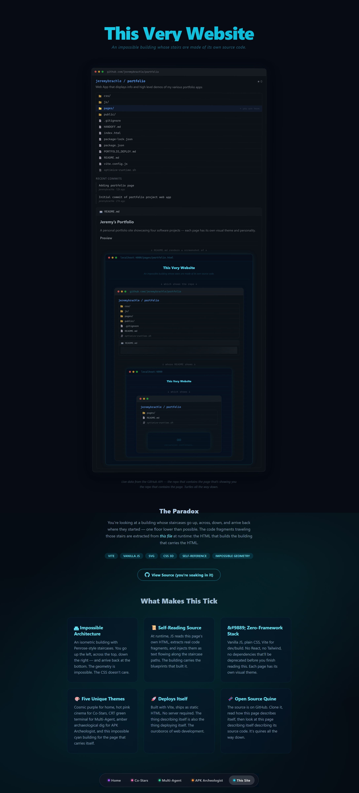

# Jeremy's Portfolio

A personal portfolio site showcasing four software projects — each page has its own visual theme and personality.

## Preview



*The portfolio page is a recursive mirror: it shows the repo that contains the page that shows the repo… ∞*

## Projects

| Page | Project | Theme |
|------|---------|-------|
| **Home** (`/`) | Landing page — project cards + visualizer | Cosmic purple, animated bars |
| **Vibe Machine** (`/pages/vibe-machine.html`) | Real-time audio visualizer | Cosmic purple, iframe embed |
| **Co-Stars** (`/pages/costars.html`) | Actor→movie connection game | Hot pink cinema, film grain overlay |
| **Multi-Agent** (`/pages/multi-agent.html`) | Document analysis pipeline | Green CRT terminal, scanlines |
| **APK Archeologist** (`/pages/apk-archeologist.html`) | Mobile game preservation CLI | Amber retro pixel, excavation motif |
| **This Site** (`/pages/portfolio.html`) | This very portfolio | Recursive mirror, self-referential |

## Quick Start

**Option A — From a WSL terminal** (recommended):
```bash
cd /home/kerry/programming/portfolio

# Install (one time)
npm install

# Dev server with hot reload
npx vite --host
# → http://localhost:4000

# Production build
npx vite build
# → outputs to dist/

# Preview production build
npx vite preview --host
```

**Option B — From PowerShell / VS Code terminal:**
```powershell
# Install (one time)
wsl bash -ic "cd /home/kerry/programming/portfolio && npm install"

# Dev server with hot reload
wsl bash -ic "cd /home/kerry/programming/portfolio && npx vite --host"
# → http://localhost:4000

# Production build
wsl bash -ic "cd /home/kerry/programming/portfolio && npx vite build"
```

> **Important:** Always run through WSL. Running `npx vite` directly in PowerShell will fail because `node_modules` contains Linux-native binaries (rollup, esbuild) that Windows Node.js can't load.

## Sanity Check — All Pages

After starting the dev server (`npx vite --host`), confirm every page loads and the nav dock shows all 6 links:

| # | URL | What to check |
|---|-----|---------------|
| 1 | http://localhost:4000/ | Home page — "Jeremy's Lab", project cards, mini-player |
| 2 | http://localhost:4000/pages/vibe-machine.html | Vibe Machine — iframe embed, feature cards |
| 3 | http://localhost:4000/pages/costars.html | Co-Stars — pink theme |
| 4 | http://localhost:4000/pages/multi-agent.html | Multi-Agent — green CRT theme |
| 5 | http://localhost:4000/pages/apk-archeologist.html | APK Archeologist — amber theme |
| 6 | http://localhost:4000/pages/portfolio.html | This Site — recursive mirror |

**On every page you should see:**
- Bottom nav dock with 6 links: Home · Vibe Machine · Co-Stars · Multi-Agent · APK Archeologist · This Site
- Draggable mini-player (bottom-left) that keeps playing across page navigations

## Structure

```
portfolio/
├── index.html                  # Home page — Jeremy's Lab
├── pages/
│   ├── vibe-machine.html       # Vibe Machine project page
│   ├── costars.html            # Co-Stars project page
│   ├── multi-agent.html        # Multi-Agent Lab project page
│   ├── apk-archeologist.html   # APK Archeologist project page
│   └── portfolio.html          # This Site — recursive mirror
├── css/
│   ├── global.css              # Nav dock, mini-player, shared utilities
│   ├── home.css                # Cosmic purple theme
│   ├── vibe-machine.css        # Cosmic purple — Vibe Machine page
│   ├── costars.css             # Hot pink cinema theme
│   ├── multi-agent.css         # Green CRT terminal theme
│   ├── apk-archeologist.css    # Amber retro pixel theme
│   └── portfolio.css           # Self-referential mirror theme
├── js/
│   ├── main.js                 # Nav state management (all pages)
│   ├── home.js                 # Visualizer bars
│   └── player.js               # Persistent draggable mini-player
├── public/
│   └── vibe-machine/           # Static Vibe Machine export (iframe'd)
├── vite.config.js              # Multi-page Vite config
└── package.json
```

## Audio

A persistent mini-player appears on every page, playing Debussy's *Clair de Lune* (public domain .ogg bundled with the Vibe Machine export). Playback state and position persist across page navigations via `sessionStorage`.

## Tech Stack

- **Vite** — dev server + build
- **Vanilla JS** — no framework, ES modules
- **CSS** — custom per-page themes, no preprocessor
- **Zero runtime dependencies**

## Status

Scaffolded and running. Project demos are placeholders — ready for actual code integration and deployment.
